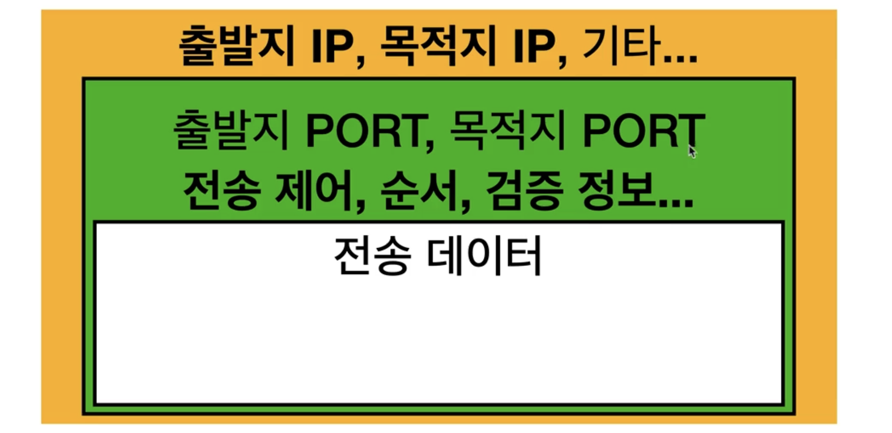

PORT

---

포트는 네트워크에서 컴퓨터 내의 특정 프로그램이나
프로세스를 식별하는데 사용되는 추상적인 개념이다.

네트워크에서 데이터가 전송될 때 IP주소가 해당 데이터가 도달해야 할 컴퓨터를 식별하는 반면,

포트 번호는 그 컴퓨터 내에서 데이터를 받아야 할 특정
애플리케이션 또는 서비스를 식별한다.

---

포트의 주요 특징

> 식별자 역할
>
> > 각각의 네트워크 요청에는 목적지 IP주소와 함께 목적지 포트 번호가 포함된다. 이를 통해 서버는 여러 네트워크 서비스를 동시에 운영할 수 있으며, 각 서비스는 고유한 포트번호를 가진다.

> 범위
>
> > 포트 번호는 0부터 65535까지 숫자로 이루어져 있다.

---
