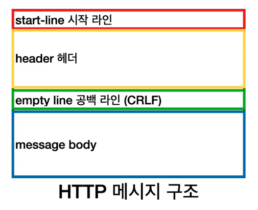
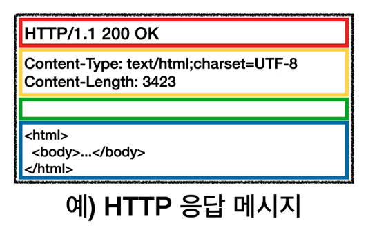

# CH3) HTTP 기본

## 1) 모든 것이 HTTP

HyperText Transfer Protocol

HTTP 메시지에 HTML 뿐만 아니라 이미지, 영상, JSON 등 모든 형태의 데이터 전송 가능하다.  
서버간에 데이터를 주고 받을 때에도 대부분 HTTP를 사용한다.

현재 HTTP/1.1 버전이 주로 사용된다.

### HTTP 특징

- 클라이언트 서버 구조
- 무상태 프로토콜(스테이스리스), 비연결성
- HTTP 메시지
- 단순함, 확장 가능

---

## 2) 클라이언트 서버 구조

- 클라이언트가 서버에 요청을 보내고, 응답을 대기 / 서버가 요청에 대한 결과를 만들어서 응답
- Request Response 구조라고 부른다.

클라이언트와 서버를 분리하면 양쪽을 독립적으로 개발할 수 있다.

---

## 3) 무상태 프로토콜 (Stateless)

- 서버가 클라이언트의 상태를 보존하지 않는다.

`상태 유지 (Stateful)` : 항상 같은 서버가 유지되어야 한다.  
`무상태 (Stateless)` : 아무 서버나 호출해도 된다.  
-> **_스케일 아웃(수평확장)_** 에 유리하다.

상태 유지가 필요한 경우: 로그인 등  
-> 일반적으로 **_브라우저 쿠키_** 와 **_서버 세션_** 등 을 사용해서 상태 유지

> (상태 유지는 최소한으로만 사용한다.)

---

## 4) 비 연결성(connectionless)

연결을 유지하는 모델은 서버가 연결을 계속 유지해야하므로 서버 자원이 소모된다.  
연결을 유지하지 않는 모델을 서버의 자원을 최소한으로 사용할 수 있다.

### 비연결성의 단점

- TCP/IP 연결을 계속 새로 맺어야 함 -> 3 way handshake 시간 추가
- 사이트를 요청하면 HTML 뿐만 아니라 다른 수 많은 자원이 함께 다운로드  
  -> HTTP 지속 연결로 해결 (Persistent Connections)  
  -> HTTP2와 3에서는 더 최적화됨

## 5) HTTP 메시지

### HTTP 메시지 구조

### HTTP 요청 메시지

- request-line = method SP request-target SP HTTP-version CRLF
  - GET: 리소스 조회
  - POST: 요청 내역 처리

### HTTP 응답 메시지

- status-line = HTTP-version SP status-code SP reason-phrase CRLF
  - 200: 성공
  - 400: 클라이언트 요청 오류
  - 500: 서버 내부 오류
